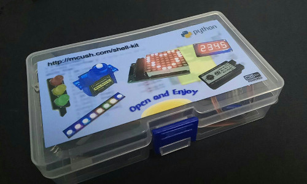

Shell Kit
=========
* Workbench App: <https://github.com/mcush/shell_kit/tree/master/app_dist>
* Demo videos: <https://github.com/mcush/shell_kit/tree/master/demo_video>
* Latest firmware: <https://github.com/mcush/shell_kit/tree/master/firmware>

Tiny controller
===============
* Brocher: <https://github.com/pengshulin/mcush/tree/master/hardware_tiny/brocher.pdf>
* Windows/VCP(Virtual Com Port) driver: <https://github.com/pengshulin/mcush/tree/master/vcp_driver>
* Schematic: <https://github.com/pengshulin/mcush/blob/master/hardware_tiny/tiny.pdf>
